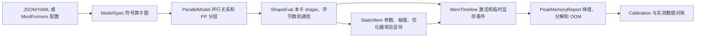

# `cost_eval` 技术报告

## 1. 项目解决什么问题

`cost_eval` 是一个离线训练显存预测器。它不启动 MindSpore，也不执行真实训练，而是根据模型结构、并行切分、优化器、重计算、Swap 和设备容量，构造一条近似的训练显存事件时间线，最终回答三个问题：

1. 每个 Pipeline stage 的峰值 HBM 是多少；
2. 峰值由哪些显存分量组成、发生在哪个事件；
3. 任一 stage 的峰值是否超过设备显存，即是否预测为 OOM。

单个 stage 在事件 `e` 时的总显存定义为：

```text
HBM(stage, e)
  = persistent
  + act_live(e)
  + gather_buf(e)
  + grad_buf(e)
  + recomp_scratch(e)
  + swap_buf(e)
  + workspace(e)
  + framework_reserve
```

峰值和 OOM 判定为：

```text
stage_peak = max_e HBM(stage, e)
stage_oom  = stage_peak > max_device_memory
global_oom = 任一 stage_oom 为真
```

这里预测的是解析模型下的字节数，不包含完善的 allocator pool、碎片和 runtime 动态基线模型。

## 2. 总体数据流



核心调用位于 `Evaluator.evaluate()`：

```python
pm = ParallelModel(...)
graph = ShapeEval().resolve(...)
persistent = StaticMem().compute(...)
peaks = MemTimeline().simulate(...)
return PeakMemoryReport(...)
```

## 3. 核心数据对象

### 3.1 符号模型与解析后模型

项目把模型分为两个层次：

- `TensorRef`、`OpSpec`、`LayerSpec`、`ModelSpec`：描述全局模型，shape 仍可写成 `"S*B"` 等符号表达式；
- `ResolvedTensor`、`ResolvedOp`、`ResolvedLayer`、`ResolvedGraph`：代入模型维度和并行度后的本卡模型，已经有明确的 `local_numel` 和 `local_bytes`。

### 3.2 七个动态显存桶

| 显存桶 | 含义 | 主要来源 |
|---|---|---|
| `persistent` | 整个训练过程中常驻的训练状态 | 参数 shard、梯度 shard、master weight、优化器状态 |
| `act_live` | 前向保存、等待反向消费的激活 | `OpSpec.saves`、重计算 checkpoint、边缘模块保存值 |
| `gather_buf` | 执行某层前临时聚合的完整本地参数 | FSDP/eFSDP gather 和预取窗口 |
| `grad_buf` | 反向计算某层梯度时的临时梯度缓冲 | 当前层或边缘模块的完整本地参数大小 |
| `recomp_scratch` | 反向重算激活或通信输出时的临时空间 | 被重计算 op 的 saved tensor、通信 volume |
| `swap_buf` | 从 CPU 预取回设备的激活 | 被 Swap 的激活及预取深度 |
| `workspace` | 算子或通信执行期间的工作区 | FlashAttention、LM head logits、collective volume 等 |

`framework_reserve` 是额外的常量，不存放在 `Buckets` 中，但每次计算总量时都会加上。

## 4. 逐文件、逐类和逐函数说明

### 4.1 `cost_eval/__init__.py`

包的公开 API 汇总文件，没有计算逻辑。它重新导出配置、模型描述和报告类，使调用方可以直接写：

```python
from cost_eval import ConfigAdapter, ParallelConfig, Evaluator
```

### 4.2 `cost_eval/__main__.py`

| 符号 | 功能 |
|---|---|
| `main(argv=None)` | 解析一个 JSON/YAML 配置路径，调用 `ConfigAdapter.load(...).evaluator().evaluate()`，再用 `dataclasses.asdict` 转成 JSON 输出；成功返回 0。 |

因此 `python -m cost_eval config.yaml` 是通用配置的命令行入口。

### 4.3 `cost_eval/model_spec.py`

#### `OpType`

算子类型枚举。包含矩阵乘、FlashAttention、逐元素、Norm、RoPE、MoE Router、MoE GEMM、Dispatch 和 Combine。类型主要用于补充特定通信或 workspace 规则，本项目不会真正执行算子。

#### `DimTable`

模型维度表。主要字段如下：

- 通用 Transformer：`H`、`F`、`n_heads`、`n_kv`、`head_dim`、`S`、`B`、`vocab`、`n_layers`；
- MoE：`n_experts`、`topk`、`moe_F`、`capacity_factor`；
- DeepSeek MLA：`q_lora_rank`、`kv_lora_rank`、`qk_nope_head_dim`、`qk_rope_head_dim`、`v_head_dim`；
- Shared Expert/MTP/HC：`n_shared`、`shared_F`、`n_mtp_layers`、`hc_mult` 等；
- 精度：激活 `dtype_bytes` 和参数 `param_dtype_bytes`。

方法和属性：

| 符号 | 功能 |
|---|---|
| `__post_init__()` | 检查必需维度、dtype 字节数和 `capacity_factor` 为正，`hc_mult` 非负。 |
| `as_dict()` | 返回可供符号表达式求值的字典，并增加 `T_routed = ceil(S*B*topk*capacity_factor)`。 |
| `total_layers` | 返回 decoder 层数加 MTP 层数。 |

#### `TensorRef`

一个符号 Tensor 合同：

- `shape` 是全局 shape；
- `shard={维度索引: mesh轴}` 描述 TP/EP/SP 等切分；
- `partial` 表示当前结果仍是某并行轴上的部分和；
- `is_weight` 区分权重和激活；
- `dtype_bytes` 可覆盖模型默认 dtype；
- `storage_id` 用于识别共享存储并去重；
- `trainable`、`swappable`、`recomputable` 描述生命周期能力。

| 符号 | 功能 |
|---|---|
| `__post_init__()` | 复制 shard 映射并检查被切分的维度索引没有越界。 |
| `has_ep()` | 判断 Tensor 是否沿 EP 切分。 |
| `is_expert` | `has_ep()` 的属性形式，用来选择 eFSDP。 |

#### `OpSpec`

描述一个算子，包含名称、类型、输入、输出、参数、反向所需的 `saves`、workspace 表达式、扩展属性和运行时模块路径。显存预测最重要的是：

- `params` 决定参数和 gather 显存；
- `saves` 决定默认激活常驻显存；
- `workspace` 决定算子执行瞬间的临时显存。

#### `LayerSpec`

按执行顺序保存一层的 `OpSpec` 列表。

#### `ModelSpec`

描述整个模型：模型名、维度表、每一层的类型序列 `layer_pattern`、不同层类型的模板 `layer_specs` 和能力标记。

| 符号 | 功能 |
|---|---|
| `__post_init__()` | 检查 `layer_pattern` 长度等于 decoder+MTP 总层数，并检查所有层类型都有模板。 |
| `get_layer(layer_type)` | 按名称返回对应层模板。 |

### 4.4 `cost_eval/specs.py`

#### `_normalize_op_map(value)`

把 `{layer: op名称或名称集合}` 统一转换为 `{int(layer): frozenset[str]}`，供重计算和 Swap 共用。

#### `ParallelConfig`

描述所有并行和调度配置。

重要公式：

```text
world_size = dp_replicate * dp_shard * cp * tp * pp
dense FSDP degree = dense_fsdp_shard_size 或 dp_shard * cp

若 ep == 1：expert FSDP degree = dense FSDP degree
若 ep > 1 ：expert FSDP degree = dp_shard * cp * tp / ep
```

EP 没有额外乘入 `world_size`，因为它是在 `dp_shard*cp*tp` 区域内部重排出的专家并行轴。

| 符号 | 功能 |
|---|---|
| `__post_init__()` | 解析 `reshard_after_forward` 策略、兼容 `pipeline_interleave` 别名、校验并行度、1F1B、CP 方法、Ulysses 和 FSDP 整除关系。默认无 PP 时前向后 reshard，有 PP 时保留 gather。 |
| `world_size` | 计算要求的总设备数。 |
| `fsdp_degree` | 返回 Dense 权重的 FSDP 分片度。 |
| `expert_fsdp_degree` | 返回 Expert 权重的 eFSDP 分片度。 |
| `virtual_pipeline_size` | 返回每个物理 stage 的虚拟 chunk 数，即 `interleave`。 |

#### `OptimizerSpec`

描述优化器每参数字节数，并保存 AdamW/Muon 元数据。

| 符号 | 功能 |
|---|---|
| `__post_init__()` | 校验总字节数，按 `state_bytes_per_param - parameter - gradient - master` 重新推导 `optimizer_state_bytes`。 |
| `name` | 返回小写优化器名。 |
| `bytes_per_parameter` | 返回总状态字节数。 |
| `is_muon` | 根据名称或 Newton–Schulz 步数判断是否为 Muon。 |
| `adamw(fp32_grad=False)` | 构造默认 AdamW；普通配置名义上为 16 bytes/param，FP32 梯度配置为 18 bytes/param。 |

实际静态计算中，梯度字节取 `weight.dtype_bytes`，没有读取 `OptimizerSpec.gradient_bytes`；Muon 的比例和 NS 步数也没有进入当前 HBM 公式。这些字段目前主要是配置合同，不应理解为已经完成精细 Muon workspace 建模。

#### `HardwareSpec`

保存设备最大可用显存和固定框架预留。

| 符号 | 功能 |
|---|---|
| `__post_init__()` | 要求设备显存为正、框架预留非负。 |

#### `RecomputeSpec`

描述 full/select/exclude 重计算和通信重计算。

| 符号 | 功能 |
|---|---|
| `__post_init__()` | 规范化 mode、层集合、op 映射、模块映射和 exclude 配置。 |
| `layers` | `full_layers` 的兼容属性。 |
| `is_full(layer_id)` | 判断指定层是否应用 full recompute；空层集合表示全部层。 |
| `recomputed_ops(layer_id, available_ops)` | 解析本层被重算的 op；支持直接选 op、选择 attention/MLP/整层模块和 exclude。`flash_attn` 映射为 `flash`，`matmul` 排除会展开成主要矩阵乘 op。 |
| `recomputed_comm_ops(layer_id, ops)` | 根据 `module_paths` 匹配带 collective 的 op，得到需要在反向重发通信的 op。 |

#### `SwapSpec`

描述 Layer/Op/模块级激活 Swap。

| 符号 | 功能 |
|---|---|
| `__post_init__()` | 兼容 `enable/enabled`、`layers/swap_layers`、`prefetch_depth/default_prefetch` 等别名并规范化选择集合。 |
| `swaps(layer_id)` | 判断是否整层 Swap；启用但未指定层/op 时表示所有层。 |
| `swapped_ops(layer_id, available_ops)` | 得到本层被 Swap 的 op，支持 attention、MLP 和整层模块组，并把 `flash_attn` 归一为 `flash`。 |

### 4.5 `cost_eval/layers/dense.py`

常量 `QKV` 和 `NHD` 分别表示：

```text
QKV = (n_heads + 2*n_kv) * head_dim
NHD = n_heads * head_dim
```

#### `hyper_connection_ops(dims, source_name)`

未启用 HC 时返回空序列。启用时增加：

1. `hc_project`：权重 `[H, H*hc_mult]`，输出 `[S,B,H*hc_mult]`，输出维按 TP 切分；
2. `hc_mix`：把原输入和投影结果混合回 `[S,B,H]`。

HC 权重本卡元素数近似为 `H*H*hc_mult/tp`，之后还会继续按 Dense FSDP 分片；激活保存源输入和投影结果。

#### `build_dense_decoder(dims)`

构造 GQA + FlashAttention + SwiGLU 层：

```text
ln1 → qkv → rope → flash → o_proj → add1
    → ln2 → fc1 → swiglu → fc2 → add2 → 可选 HC
```

主要参数的 TP 后、FSDP 前本卡元素数为：

```text
qkv_w : H * ((n_heads + 2*n_kv)*head_dim) / tp
o_w   : (n_heads*head_dim) * H / tp
fc1_w : H * (2F) / tp
fc2_w : F * H / tp
```

这些数还要除以 Dense FSDP degree 才得到常驻 shard。Dense 模板中的 `ln1/ln2` 没有显式登记 Norm 权重；最终 Norm 权重在边缘模块中单独登记。

默认保存的主要激活来自 `x`、`ln1`、`qkv`、`attn`、`lse`、`h1`、`ln2`、`gate` 和 `act`，同名 Tensor 在一层内只计一次。Flash workspace 的当前公式是：

```text
S * B * n_heads * head_dim * dtype_bytes
```

它作为直接表达式求值，当前实现没有再按 TP/CP 缩小，是一个显式近似。

### 4.6 `cost_eval/layers/moe.py`

#### `build_moe_decoder(dims)`

先检查专家数、Top-K 和专家中间维为正，然后复用 Dense 层前六个 attention op，再接：

```text
router → dispatch → expert_fc1 → expert_swiglu → expert_fc2 → combine
       → 可选 HC
```

路由 Token 上界：

```text
T_routed = ceil(S * B * topk * capacity_factor)
```

主要 Expert 参数的 EP 后、eFSDP 前本卡元素数：

```text
expert_w1 = n_experts * H * 2*moe_F / ep
expert_w2 = n_experts * moe_F * H / ep
```

Expert 激活 `dispatched/gate/act/expert_out` 沿 EP 切分。若 dispatcher 名称包含 deredund 或 zero_redundancy，它们还会在 Token 维额外除以 TP。Dispatch/Combine 的 workspace 会额外加入其输出 Tensor 的本卡字节数，表示本地 permute/unpermute 缓冲；EP>1 时还会添加 all-to-all 通信 volume。

### 4.7 `cost_eval/layers/deepseek.py`

#### `_norm_weight(name, dim="H")`

创建一个 FP32、可训练的一维 Norm 权重。

#### `build_mla_attention(dims)`

构造 DeepSeek MLA attention，顺序为：输入 Norm、联合 Q/KV 下投影、Q/KV/位置分量拆分与 Norm、Q/KV 上投影、RoPE、FlashAttention、输出投影和残差。

主要权重元素数：

```text
down = H * (q_lora_rank + kv_lora_rank + qk_rope_head_dim)
q_up = q_lora_rank * n_heads * (qk_nope_head_dim + qk_rope_head_dim) / tp
kv_up = kv_lora_rank * n_heads * (qk_nope_head_dim + v_head_dim) / tp
o_proj = n_heads * v_head_dim * H / tp
```

Q/KV 上投影前，输入从 SP placement 变为 replicate，`ShapeEval` 会据此推导必要通信。MLA Flash workspace 为 `S*B*n_heads*v_head_dim*dtype_bytes`。

#### `_moe_tail(dims)`

构造 DeepSeek 的 MoE 尾部：Norm、FP32 Router、路由专家分支、可选 Shared Expert、可选 FP32 Shared Expert Gate、分支合并和残差。

Shared Expert 参数：

```text
shared_fc1 = H * 2*shared_F
shared_fc2 = shared_F * H
optional gate = H * 1，FP32
```

Shared Expert 参数没有 TP shard 标记，当前模型按 replicate 后再做 Dense FSDP。

#### `_dense_tail()`

构造 MLA Dense 层的 Norm + SwiGLU FFN + 残差部分。

#### `build_mla_dense_decoder(dims, include_hc=True)`

组合 MLA attention、Dense tail 和可选 HC。

#### `build_mla_moe_decoder(dims, include_hc=True)`

组合 MLA attention、MoE/Shared Expert tail 和可选 HC。

#### `build_mtp_layer(dims)`

构造 MTP 层：

```text
embedding norm + previous hidden norm
→ concat [2H]
→ eh_proj [2H,H]
→ 一层完整 MLA-MoE block
→ final norm
→ 可选 HC
```

MTP 会被 `ShapeEval` 固定放到最后一个 PP stage。Embedding/输出头的共享关系通过 `storage_id` 表达。

### 4.8 `cost_eval/layers/__init__.py`

导出 Dense、MoE、MLA Dense、MLA MoE 和 MTP builder，没有额外计算。

### 4.9 `cost_eval/parallel_model.py`

#### `ParallelModel._StageLayers`

一个只读 Mapping 包装器，使 `stage_layers` 既可写成 `stage_layers[stage]`，也可写成 `stage_layers(stage)`。

| 符号 | 功能 |
|---|---|
| `__init__(owner)` | 保存外层 `ParallelModel`。 |
| `__getitem__(stage)` | 返回指定 stage 的层元组。 |
| `__iter__()` | 遍历全部 stage id。 |
| `__len__()` | 返回 PP 数。 |
| `__call__(stage)` | 返回指定 stage 的层列表。 |

#### `ParallelModel`

把并行配置变成可查询的 mesh degree 和 layer→stage 映射。

| 符号 | 功能 |
|---|---|
| `build(pc, dims, world_size=None)` | 用 `dims.n_layers` 快速构造对象。 |
| `__init__(...)` | 校验 PP、world size、EP 整除和 interleave；计算 eFSDP degree；建立层分配。 |
| `degree(axis)` | 返回 `tp/cp/ep/dp_shard/dp_replicate/pp`；`sp` 在 sequence parallel 开启时等于 TP，否则为 1。 |
| `fsdp_degree()` | Dense FSDP degree。 |
| `efsdp_degree()` | Expert eFSDP degree。EP=1 时退化为 Dense FSDP。 |
| `stage_of(layer_id)` | 返回层所在物理 stage。 |
| `_stage_layers(stage)` | 返回物理 stage 包含的所有层。 |
| `_build_layer_to_stage()` | 支持“每 stage 层数”、显式层 id 列表或自动均分；自动均分时余数放到靠前 stage。 |

### 4.10 `cost_eval/shape_eval.py`

#### `eval_expr(expr, dims)`

安全计算 shape/workspace 表达式。只允许：整数、`DimTable` 中的名称、`+ - * //` 和正负号；禁止函数调用、属性访问等任意 Python 代码。结果必须是非负整数。

内部嵌套函数 `evaluate(node)` 递归解释允许的 AST 节点。

#### `Placement`

不可变的 placement：`shard` 保存“维度→并行轴”，`partial` 保存未归约的并行轴。

| 符号 | 功能 |
|---|---|
| `__init__(shard=(), partial=None)` | 对 shard 排序并转为稳定元组。 |
| `of(tensor)` | 从 `TensorRef` 构造 Placement。 |
| `shards` | `shard` 的兼容属性。 |

#### `CommSpec`

通信合同，记录通信类型、volume、group axis、前后向阶段、输出 Tensor 以及可选拓扑和算法信息。

| 符号 | 功能 |
|---|---|
| `kind` | `ctype` 的兼容属性。 |

#### `detect_reshard(src, dst, numel=None, dtype_bytes=None)`

比较生产者和消费者 placement，推导通信：

| Placement 变化 | 通信 |
|---|---|
| partial → shard | reduce-scatter |
| partial → replicate | all-reduce |
| shard → replicate | all-gather |
| 一种 shard → 另一种 shard | all-to-all |
| replicate → shard | 不需要通信 |

通信 volume 当前取目标 Tensor 的 `local_numel*dtype_bytes`。

#### `ResolvedTensor`

本卡 Tensor：保存全局/本地 shape、元素数、dtype、权重/专家属性、placement 和生命周期属性。

| 符号 | 功能 |
|---|---|
| `local_bytes` | `local_numel*dtype_bytes`。 |
| `tid` | 返回 Tensor 名称。 |

#### `resolve_tensor(tensor, dims, pm)`

本卡 shape 计算的核心函数：

1. 用 `eval_expr` 求出全局 shape；
2. 若 dim0 标为 SP，先按 CP 切一次；
3. 再按 Tensor 自身的 shard 逐维切分，其中 SP 的 degree 是 TP 或 1；
4. 对 deredund MoE dispatcher 的路由激活，Token 维再按 TP 切分；
5. degree=1 的 partial 被消掉；
6. 权重默认使用 `param_dtype_bytes`，激活使用 `dtype_bytes`；
7. 本卡元素数为本地各维乘积。

一个 `[S,B,H]` 且 dim0 标为 SP 的激活，在 CP和Sequence Parallel都开启时，本卡元素数为：

```text
S/CP/TP * B * H
```

#### `ResolvedOp`

解析后的算子，所有 Tensor 已有本卡字节数，并增加 `workspace_bytes` 和 `collectives`。

#### `ResolvedLayer`

解析后的层。

| 符号 | 功能 |
|---|---|
| `activation_bytes` | 按 Tensor 名去重，求该层所有 `saves` 的本卡字节和。 |
| `checkpoint_bytes` | 返回第一个非权重输入的本卡字节数。 |

#### `ResolvedGraph`

保存 `stage -> layers`、边缘参数、stage 输出大小和边缘算子。

#### `ShapeEval.resolve(spec, pm)`

把 `ModelSpec` 解析成 `ResolvedGraph`：

1. 逐层、逐 op 解析输入、输出、参数和 saved tensor；
2. saved tensor 在单个 op 内按名称去重；
3. 比较生产 placement 与消费 placement，生成 reshard 通信；
4. CP FlashAttention 额外添加：Colossal 的 ring P2P、Ulysses 的 all-to-all、Hybrid 的内层 all-to-all 加外层 ring；
5. EP Dispatch/Combine 添加 all-to-all；
6. Dispatch/Combine workspace 再加输出本卡字节数；
7. 普通/MoE decoder 按 PP 映射放置，MTP 固定放在最后 stage；
8. 构造三个边缘模块：stage 0 的 Embedding，最后 stage 的 Final Norm 和 LM Head。

边缘模块显存要点：

- Embedding 权重 `[vocab,H]` 沿 vocab 做 TP，再做 Dense FSDP；前向保存 int32 token ids；
- Final Norm 权重为 `[H]` FP32，再做 Dense FSDP；
- LM Head 权重 `[vocab,H]` 沿 vocab 做 TP，再做 Dense FSDP；如果 tie embedding，用相同 `storage_id`；
- logits 为 `[S,B,vocab]`。开启 loss parallel 时 vocab 维保留 TP shard；否则 TP>1 会添加 all-gather；
- LM Head 自身 workspace 等于 logits 本卡字节，非 loss-parallel 的 all-gather volume 还会再加入 workspace 峰值。

### 4.11 `cost_eval/static_mem.py`

#### `StaticBreakdown`

保存参数、梯度、master weight 和优化器状态四类常驻字节。

| 符号 | 功能 |
|---|---|
| `total` | 四类字节之和。 |

#### `StageStaticMemory`

保存一个 stage 的常驻总量、拆解、边缘参数全局字节数和 decoder 常驻量。

| 符号 | 功能 |
|---|---|
| `total`、`__int__()` | 返回 `persistent_bytes`。 |
| `__eq__(other)` | 与整数比较时兼容比较总常驻或 decoder 常驻；主要服务历史测试。 |
| `__floordiv__(other)` | 对 decoder 常驻量做整除；也是兼容辅助。 |

#### `_unique_layer_params(layer)`

遍历一层所有 op 的参数，按 `storage_id`，没有时按名称去重。

#### `_state_bytes(weight, optimizer)`

计算一个“已经完成 TP/EP 和 FSDP 分片”的权重 shard 的常驻状态：

```text
parameter = local_numel * weight.dtype_bytes
gradient  = local_numel * weight.dtype_bytes
master    = 0                                  当权重为 FP32
            local_numel * master_weight_bytes  否则
state     = local_numel * optimizer_state_bytes
```

不可训练权重只计算参数自身。

#### `_add_breakdown(left, right)`

逐字段相加两个静态显存拆解。

#### `StaticMem.compute(graph, optimizer, pm, cpu_offload=None)`

逐 stage 计算常驻显存：

1. 对每层参数按共享存储去重；
2. Expert 参数除以 eFSDP degree，其他参数除以 Dense FSDP degree；
3. 对每个 shard 调用 `_state_bytes`；
4. 单独处理 Embedding、Final Norm、LM Head 等 edge 权重，并按 storage identity 去重；
5. decoder 与 edge 拆解相加；
6. CPU offload 开启时，设备常驻总量和拆解置零。

注意：CPU offload 只把常驻状态清零，执行某层时的参数 gather 仍会在时间线中计算。

### 4.12 `cost_eval/mem_timeline.py`

#### `Event`

表示调度事件，保存 `kind`、microbatch id、可选 layer id 和 virtual chunk id。

#### `build_1f1b(stage, pp, m=None, microbatches=None)`

构造单个物理 stage 的 1F1B 宏事件。Warmup 前向数为：

```text
warmup = min(pp - 1 - stage, num_microbatches)
```

Warmup 后，只要还有前向，就执行一组 `FWD` 后跟一个 `BWD`；前向发完后排空剩余反向。

#### `build_interleaved_1f1b(stage, pp, m, interleave)`

把每个 1F1B 宏事件展开到 virtual chunks：

- 前向按 chunk `0 → interleave-1`；
- 反向按 chunk `interleave-1 → 0`。

#### `Buckets`

运行中的七个动态/静态显存桶。

| 符号 | 功能 |
|---|---|
| `total()` | 七个桶求和，不含 framework reserve。 |

#### `MemBreakdown`

峰值发生时八个分量的不可变快照，包含 framework reserve。

| 符号 | 功能 |
|---|---|
| `total` | 八个分量求和。 |

#### `StagePeak`

一个 stage 的最终结果：峰值、峰值时拆解、事件名、OOM 和各桶历史最大值。

#### `BucketPeaks`

每个桶各自出现过的最大值。它们不一定同时发生，因此各字段相加通常不等于 `peak_bytes`。

#### `LayerMemoryPlan`

一层经过重计算和 Swap 策略后得到的激活计划：设备常驻、CPU offload、反向重算 scratch、被重算 op 和通信重算信息。

`resident`、`offloaded`、`recomputed` 是对应字节字段的兼容属性。

#### `_unique_tensors(tensors)`

按 `storage_id` 或名称去重 Tensor。

#### `_layer_memory_plan(layer, recompute, swap)`

这是激活显存计算的核心：

1. 解析本层重计算 op、Swap op 和通信重计算 op；重计算优先于 Swap；
2. 收集每个 op 的 saved tensor；
3. 未重算 op 的 saved tensor 放入 `resident_names`；
4. 重算 op 的 saved tensor 放入 `scratch_names`；
5. 每一段连续重算区域只保留第一个非权重输入作为 checkpoint；
6. checkpoint 加入常驻，并从 scratch 去掉，避免重复；
7. 通信重算会从常驻集合删除对应 collective 输出，反向 scratch 等于被重发通信的 volume 和；
8. Swap 候选是选中 op 的 saved tensor；若同一 Tensor 也被未 Swap op 使用，就不能 offload；checkpoint 也不能 offload；
9. 最终按 Tensor 名求和得到常驻、offload 和重算 scratch 字节。

内部函数 `byte_sum(names)` 把指定 Tensor 名集合转换为去重后的本卡字节和。

集合关系可写成：

```text
resident = 未重算 op 的 saves + checkpoints
resident -= 通信重算输出

offloaded = Swap候选 saves - 未Swap使用的 saves - checkpoints
resident  -= offloaded

recompute_scratch = 重算 op 的 saves - resident
```

#### `_save_plan(layer, recompute, swap)`

`_layer_memory_plan` 的公开兼容包装。

#### `_layer_fsdp_buffer_bytes(layer, pm)`

按共享存储去重一层参数。若参数对应 FSDP/eFSDP degree 大于 1，或开启 CPU offload，就把该参数在 TP/EP 后、FSDP 前的 `local_bytes` 加入 gather buffer。

因此它表示“为了执行这一层，需要临时恢复出的完整本地参数”，不是常驻 shard。

#### `_layer_workspace(layer)`

逐 op 计算：

```text
op_workspace = op.workspace_bytes + max(op 的通信 volume)
layer_workspace = max(op_workspace)
```

多个通信只取最大单项，不求和；然后取整层最大 op，而不是把所有 op workspace 相加，因为算子顺序执行。

#### `_op_fsdp_buffer_bytes(op, pm)`

计算 Embedding、Final Norm、LM Head 等单个边缘 op 的参数 gather 字节。无 FSDP且无CPU offload时返回0，否则按参数共享存储去重求和。

#### `_edge_saved_bytes(ops)`

计算本 stage 边缘 op 的非权重 saved tensor 总量，并按共享存储去重。

#### `MemTimeline.simulate(...)`

逐 stage 模拟事件并取峰值，完整步骤如下。

**准备阶段**

1. `persistent` 初始化为 `StageStaticMemory`；
2. 计算每层 gather buffer、workspace 和 activation plan；
3. 把 edge op 分成前缀 Embedding 与后缀 Final Norm/LM Head；
4. `pinned[(microbatch, layer)]` 保存该 microbatch 在该层的 `(resident, offloaded)`；
5. 每次 `record(tag)` 都计算七桶总和加 framework reserve，更新总峰值和各桶独立峰值。

**Gather 策略**

若 `reshard_after_forward=True`，当前层和预取层构成窗口：

```text
前向窗口 = 当前层 ... 当前层+prefetch_depth
反向窗口 = 当前层-prefetch_depth ... 当前层
```

窗口内各层的 FSDP buffer 求和。若 `reshard_after_forward=False`，已 gather 的层会加入集合并持续保留，直到时间线结束；这近似表示 PP 下不在前向后立即 reshard。

内部函数 `gather_window(index, backward=False, ids=None)` 负责计算上述前向或反向窗口内各层 gather 字节之和。

**前向事件**

1. 第一个 chunk 执行 Embedding：记录 edge gather 和 edge workspace；
2. 对当前 chunk 的层按正序执行：
   - 放入当前/预取 gather window；
   - 放入该层最大 workspace；
   - workspace 归零；
   - 把本层 resident 激活加入 `act_live`；
   - 把 resident/offloaded 记入 `pinned`；
3. 最后一个 chunk 执行 Final Norm 和 LM Head；
4. 最后一个 chunk 把 edge saved tensor 加入 `act_live`。

**反向事件**

1. 最后一个 chunk 先逆序反向 Final Norm/LM Head：gather 后建立等大的 grad buffer，再释放；
2. 当前 chunk 的层按逆序执行：
   - 放入反向 gather window；
   - 按 `swap.default_prefetch` 对当前层及后续反向层的 offloaded 激活求和，形成瞬时 `swap_buf`；
   - 若本层有 op 重计算，`recomp_scratch` 暂时等于该层重算 saves 字节；
   - 若有通信重计算，`recomp_scratch` 暂时等于通信 volume；
   - `grad_buf` 暂时等于该层完整本地参数字节；
   - 当前层反向结束后，从 `act_live` 减去 resident，并删除 `pinned`；
3. 最后一个 chunk 释放 edge saved tensor；
4. 第一个 chunk 最后逆序处理 Embedding 的 gather 和梯度。

**输出阶段**

对每个 stage 生成：

```text
StagePeak(
    peak_bytes = 所有 record 时刻的最大值,
    breakdown = 峰值发生时的共时分解,
    peak_event = 对应 tag,
    oom = peak_bytes > max_device_memory,
    bucket_peaks = 每个桶各自历史最大值,
)
```

### 4.13 `cost_eval/report.py`

#### `PeakMemoryReport`

顶层报告：逐 stage 峰值、最紧 stage、全局 OOM、静态显存、模型摘要和适配警告。

#### `ModelSummary`

保存模型名、decoder+MTP 总层数和 world size。

#### `Evaluator`

统一评估入口。

| 符号 | 功能 |
|---|---|
| `__init__(...)` | 保存模型、并行、优化器、硬件和策略；缺省时创建空重计算和空 Swap。 |
| `evaluate()` | 依次执行并行建模、Shape 解析、静态显存计算和时间线模拟；选择峰值最大的 stage；任一 stage OOM 即全局 OOM。 |

### 4.14 `cost_eval/config_adapter.py`

#### `parse_bytes(value)`

把整数或 `60 GiB`、`80GB` 等字符串转成字节；同时支持十进制 KB/MB/GB 和二进制 KiB/MiB/GiB。

#### `_parse_yaml_scalar(text)`

解析简化 YAML 的布尔、空值、引号字符串、行内列表/字典、整数、浮点和普通字符串。

#### `_simple_yaml_load(text)`

解析本项目所需的 YAML 子集：缩进映射、标量和标量列表。内部 `parse_block(index, indent)` 递归解析一个缩进块并检查非法缩进。

#### `_section(config, *names)`

按多个候选名字取得首个配置 section，并确保它是 Mapping；不存在则返回空字典。

#### `EvaluationInputs`

聚合 `ModelSpec`、并行、优化器、硬件、重计算和 Swap。

| 符号 | 功能 |
|---|---|
| `evaluator()` | 用六类输入创建 `Evaluator`。 |

#### `ConfigAdapter`

| 符号 | 功能 |
|---|---|
| `from_dict(config)` | 校验通用配置；构造 `DimTable`；按 `layer_pattern` 构造 Dense/MoE 模板；解析并行别名、AdamW/Muon/自定义优化器字节、硬件、重计算和 Swap。当前通用 adapter 的 builder 只接受 `dense` 与 `moe`。 |
| `load(path)` | 用 `load_data_file` 读取文件，再调用 `from_dict`。 |

#### `load_data_file(path)`

按扩展名读取 JSON 或 YAML；其他扩展名报错。该函数也被 Calibration 复用。

### 4.15 `cost_eval/adapters/__init__.py`

导出 `MindFormersAdapter` 和 `MindFormersInputs`，没有额外计算。

### 4.16 `cost_eval/adapters/mindformers.py`

#### `MindFormersInputs`

与 `EvaluationInputs` 类似，但字段名贴近 MindFormers，并附带 `warnings` 和配置来源。

| 符号 | 功能 |
|---|---|
| `evaluator()` | 创建 `Evaluator` 并把适配警告带入最终报告。 |

#### `MindFormersAdapter`

| 符号 | 功能 |
|---|---|
| `from_yaml(path, world_size, framework_reserve=0)` | 读取 MindFormers YAML，记录绝对来源路径，调用 `from_mapping`。 |
| `from_mapping(data, world_size, framework_reserve=0, source="<mapping>")` | 完整适配入口。解析 section、并行域、batch/microbatch、模型 family、优化器、重计算、Swap 和警告。 |

`from_mapping` 的关键推导：

```text
base = tp * cp * pp
data_parallel = world_size / base

若 data_parallel_shard < 0：
    dp_shard = data_parallel
    dp_replicate = 1
否则：
    dp_replicate = data_parallel / dp_shard

num_microbatches
  = global_batch_size
    / (data_parallel * local_batch_size * micro_batch_interleave_num)
```

它还执行以下规则：

- 当前只接受 `optim_grads_params` data-parallel shard 策略；
- TP>1 时要求 sequence parallel；
- MLA 配置选择 MLA Dense/MoE builder；
- MTP 层追加到 pattern 并放置到最后 stage；
- dispatcher、optimizer 或 Shared Expert 信息无法精确映射时写入 warning。

#### `load_mindformers_yaml(path)`

优先用 PyYAML 安全加载；没有 PyYAML 时使用项目内的简化解析器。

#### `parse_memory_bytes(value)`

解析 MindFormers 的 B/KB/MB/GB/TB，单位按 1024 进制。

#### `_build_model_shape(model, training)`

从 MindFormers 别名提取模型维度，构造 `DimTable` 和 Dense/MoE pattern。支持 GQA、MLA、Shared Expert、MTP、HC 和 dtype；缺少 Shared Expert 宽度时给出 warning 并省略该分支。

#### `_moe_pattern(model, layers, experts)`

决定每层是 Dense 还是 MoE：无专家则全 Dense；支持前 K 层 Dense、逐层 0/1 列表或固定 MoE 频率。

#### `_build_optimizer(config, model, warnings)`

按参数 dtype 构造 AdamW 或 Muon 合同。未知优化器退回 AdamW 字节模型并告警。

#### `_build_recompute(config, recompute_comm, n_layers, warnings)`

把 MindFormers full/select/exclude 和通信重计算字段转换为 `RecomputeSpec`；select 必须提供模块，full 必须提供层选择，通信重计算必须提供模块。

#### `_build_swap(config, n_layers, warnings)`

解析 layer/op Swap 和预取深度；检查预取不会越过模型最后一层；未知模块组写入 warning。

#### `_parse_stage_layers(value, n_layers)`

把自动或显式 PP 层范围转换为“每个 stage 的层 id 元组”。

#### `_parse_layer_selection(value, n_layers)`

解析整数、Mapping、列表、`"0-4"` 和 `"0-4,9-12"`，并检查层 id 不越界。

#### `_parse_module_selection(value, n_layers)`

把多种 MindFormers module/op 选择格式统一成 `{module_name: layer_set}`。

#### `_load_yaml_subset(text)`

无 PyYAML 时的降级解析器，只读取顶层 section 和其中的简单键值。

#### `_strip_comment(line)`

删除不在引号内的 `#` 注释。

#### `_parse_scalar(value)`

解析降级 YAML 中的空值、布尔、Python literal、行内列表、整数、浮点和字符串。

#### `_section(data, name)`

取得 MindFormers section，并检查类型。

#### `_required_alias(data, *names)`

从多个字段别名中取得第一个存在的整数；全部缺失时报错。

#### `_positive_int(value, name)`

转换并要求整数至少为 1。

#### `_optional_int(value)`

把非空值转成整数，否则返回 `None`。

#### `_dtype_bytes(value)`

把 FP16/BF16 映射为 2 bytes，FP32 映射为 4 bytes；其他 dtype 报错。

### 4.17 `cost_eval/source_contracts/deepseek_v3.py`

没有函数。常量 `DEEPSEEK_V3_PYNATIVE` 是可审计的源码合同，记录 MLA、Shared Expert、MTP、边缘 FSDP、通信重计算和 CP 公式分别来自目标 MindFormers 的哪个源码模块。它不参与运行时计算，作用是让实现公式可追溯。

### 4.18 `cost_eval/source_contracts/__init__.py`

导出 `DEEPSEEK_V3_PYNATIVE`，没有计算逻辑。

### 4.19 `cost_eval/calibration.py`

Calibration 不改变预测公式，它负责把离线预测与真机数据对账。

#### `MetricComparison`

保存预测值、实测值、有符号误差、绝对误差和相对误差。

| 符号 | 功能 |
|---|---|
| `compare(predicted, measured)` | 计算 `signed=predicted-measured`、`absolute=abs(signed)`、`relative=absolute/measured`；实测为0时按特殊规则处理。 |

#### `StageCalibration`

保存单 stage 的峰值误差、峰值事件匹配、预测拆解和各显存桶误差。

#### `CaseCalibration`

保存单个案例的所有 stage、预测/实测 OOM、OOM 是否匹配、framework reserve 对比、元数据和 stage 峰值排序是否一致。

#### `CalibrationSummary`

保存案例数、stage 数、平均/P50/P90/最大相对误差、平均偏差、达标率、事件匹配率、OOM 混淆矩阵、建议 framework reserve 和 stage 排序匹配率。

#### `CalibrationReport`

由案例列表和汇总指标组成的顶层校准报告。

#### `_percentile(values, quantile)`

排序后用线性插值计算分位数。

#### `_event_phase(event)`

把具体 `fwd_*`/`bwd_*` 事件归一成 `forward`/`backward`。

#### `_event_matches(predicted, measured)`

具体事件相同或归一后的前/反向阶段相同都视为匹配；没有实测事件时返回 `None`。

#### `_stage_order_match(predicted_stages, measured_peaks)`

分别按峰值降序、stage id 升序打破平局，检查预测和实测的 stage 紧张程度顺序是否完全一致。

#### `_normalize_stage_mapping(value, field_name)`

把 JSON 中可能为字符串的 stage key 统一转成整数。

#### `CalibrationRunner`

| 符号 | 功能 |
|---|---|
| `__init__(target_relative_error=0.10)` | 保存目标误差，要求在 0 和 1 之间。 |
| `run_case(name, inputs, measured, metadata=None)` | 运行一次预测；严格对齐 stage；比较峰值、事件、各桶和 framework reserve；推导或读取实测 OOM；计算 stage 排序。只有 `measured.oom=true` 的纯分类案例可以没有峰值。 |
| `run_cases(cases)` | 聚合误差分位数、达标率、事件/排序匹配率、OOM TP/TN/FP/FN，并用实测 reserve 中位数给出建议值。 |
| `run_profile(path)` | 读取单个或多个 profile case；支持通用和 MindFormers adapter、内嵌配置或相对配置路径；逐案例运行后汇总。 |

#### `main(argv=None)`

校准 CLI。输出 JSON；使用 `--fail-on-threshold` 时，只要出现 OOM 漏报、P90 超过目标或 PP stage 排序不一致，就返回状态码 2，否则返回 0。

## 5. 最终 HBM 计算的底层步骤

下面把前面的模块压缩成一条从配置到结果的算法。

### 步骤 1：解析配置

通用配置走 `ConfigAdapter`，真实 MindFormers 配置走 `MindFormersAdapter`。产出六类输入：模型、并行、优化器、硬件、重计算和 Swap。

### 步骤 2：建立符号算子图

根据层类型选择 Dense、MoE 或 DeepSeek builder。每个 op 显式声明参数、反向保存激活和 workspace。模型这一阶段仍是全局 shape。

### 步骤 3：建立并行关系和 PP 分层

`ParallelModel` 校验 world size，计算 Dense FSDP/eFSDP degree，并决定每层属于哪个物理 stage、哪个 interleave chunk。

### 步骤 4：把全局 Tensor 变成本卡 Tensor

`ShapeEval` 对每个 Tensor：

```text
global_shape
→ 按 CP/TP/EP/SP 切分
→ local_shape
→ local_numel = prod(local_shape)
→ local_bytes = local_numel * dtype_bytes
```

同时通过 placement 变化推导通信和通信 volume。

### 步骤 5：计算常驻显存

先得到 TP/EP 后的本卡参数，再除以 FSDP/eFSDP degree，最后为每个 shard 加上参数、梯度、master weight 和优化器状态。共享权重按 storage identity 去重。

### 步骤 6：计算每层激活计划

从所有 `saves` 开始，根据重计算、通信重计算和 Swap 把 Tensor 分为：设备常驻、CPU offload、反向重算 scratch。连续重算区只留下入口 checkpoint。

### 步骤 7：计算每层瞬时缓冲

- gather：该层完整本地参数，加上预取窗口中的相邻层；
- workspace：整层所有 op 的 `op workspace + 最大通信 volume` 的最大值；
- grad buffer：反向当前层的完整本地参数大小；
- Swap buffer：反向预取窗口内 offloaded 激活之和；
- recompute scratch：该层被重算 saved tensor 或通信 volume。

### 步骤 8：沿 1F1B 时间线更新生命周期

每个 microbatch 前向时增加 resident 激活，反向完成该层后减少；所有 gather、workspace、Swap、重算和梯度 buffer 都只在对应事件临时出现。每个离散事件后都调用 `record()` 检查总量。

### 步骤 9：生成逐 stage 峰值

保存最大总量、峰值事件、当时的共时分解和各桶独立峰值，并用严格大于比较设备容量。

### 步骤 10：生成全局报告和可选校准

峰值最大的 stage 是 `tightest_stage`；任一 stage OOM 即全局 OOM。若提供实测 Profile，再由 Calibration 计算误差、事件一致性、stage 排序和 OOM 混淆矩阵。

## 6. 如何正确理解输出

1. `breakdown` 是峰值那一刻同时存在的分量，可以相加得到 `peak_bytes`。
2. `bucket_peaks` 是每个桶在整个时间线上的各自最大值，发生时刻可能不同，不能直接相加。
3. `persistent` 是 FSDP shard 后的常驻训练状态，不是模型总参数量。
4. `gather_buf` 是恢复出的完整本地参数，已经考虑 TP/EP，但未除 FSDP。
5. `oom=false` 只表示当前解析模型的点预测没有越界，不等于带 allocator 碎片和 runtime 波动的安全上界。

## 7. 当前实现边界

- 只建模显存字节，不计算训练时间、通信时间或 overlap；
- allocator pool、碎片、设备 baseline 仍由单一 `framework_reserve` 近似；
- Flash workspace、通信 staging、PP interleave 和 offload/DMA 生命周期是解析近似，需要真机校准；
- 通用 Adapter 只直接构造 Dense/MoE，DeepSeek 主要通过 MindFormers Adapter；
- Muon 的比例、NS workspace，以及 `OptimizerSpec.gradient_bytes` 尚未完整进入静态 HBM 算法；
- OOM 使用点预测 `peak > capacity`，尚不是带置信区间的生产安全判定。

因此，本项目当前最可靠的用途是：解释显存构成、比较并行/重计算/Swap 配置的方向性影响、定位最紧 stage，并用 Calibration 对具体环境做验证。
